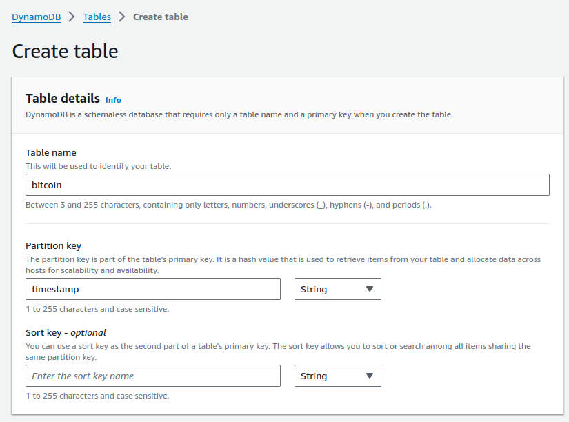
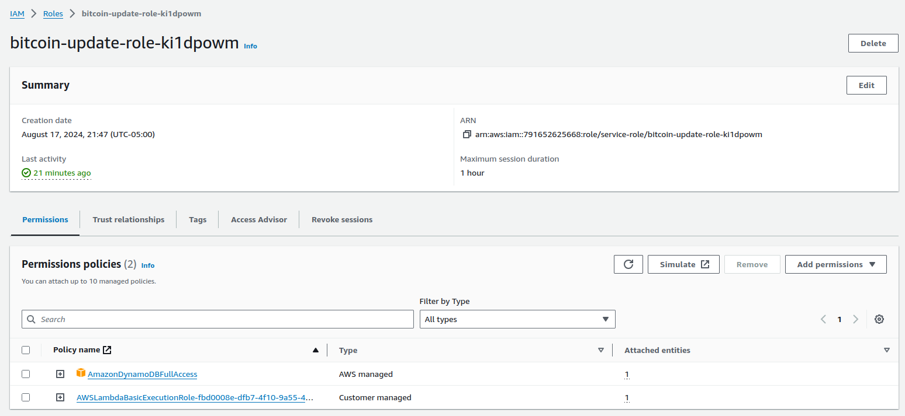
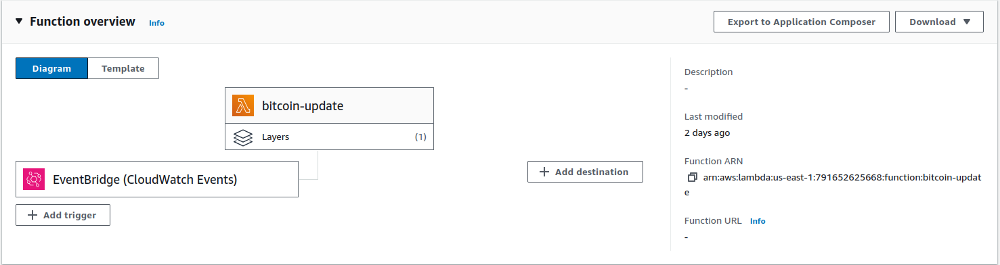
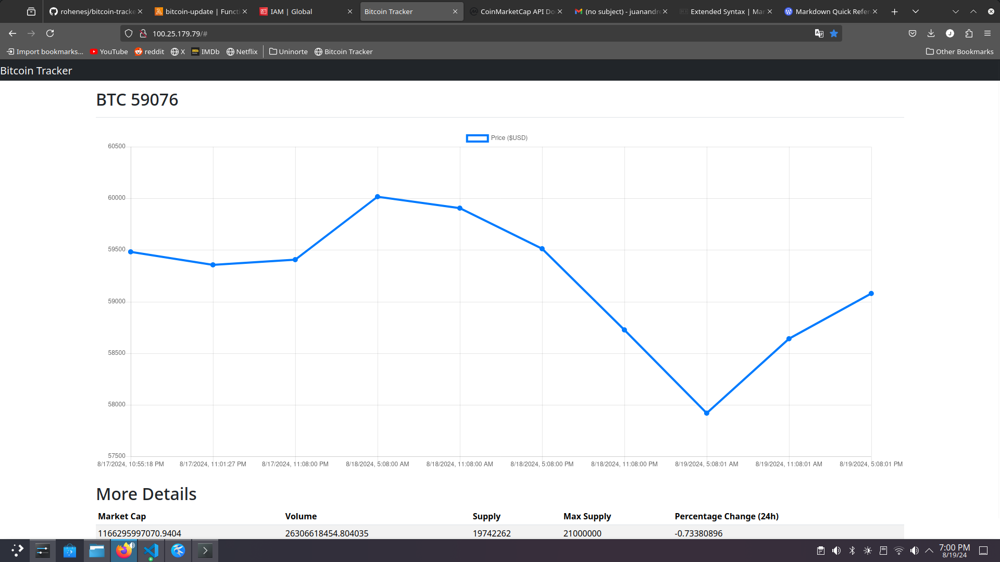
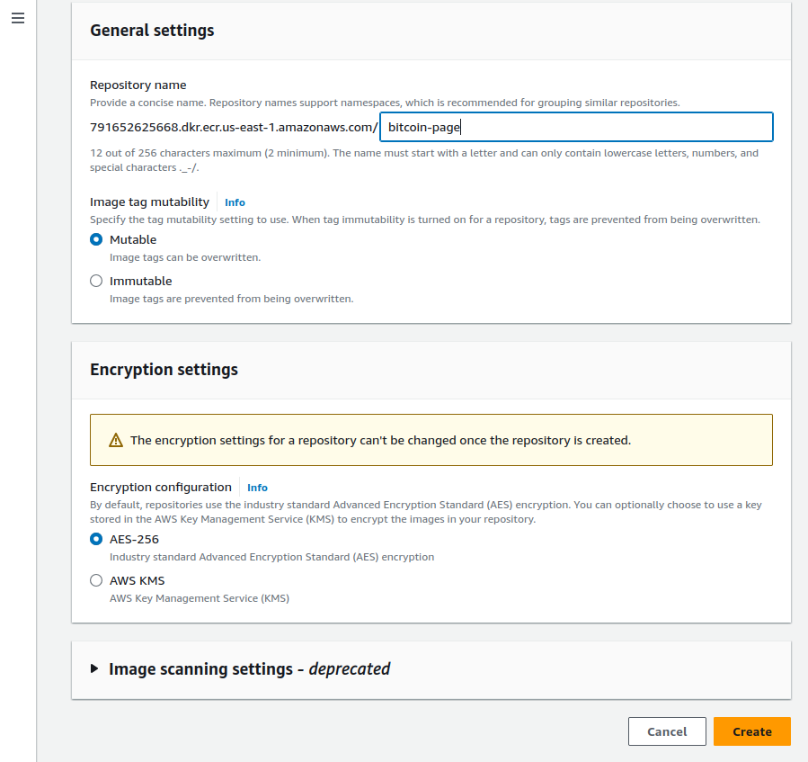
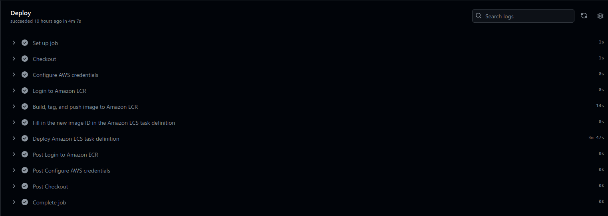

# bitcoin-tracker

En este documento se explicará en detalle la implementación de la página Bitcoin Tracker. Esta consiste en usar la API de CoinMarketCap para extraer datos relevantes de Bitcoin y guardarlos en una base de datos en Amazon AWS. Este proceso se realiza de forma periódica, cada 6 horas, utilizando un servicio Lambda de AWS. Por otra parte, se despliega una página web donde estos datos son claramente visibles y comprensibles, utilizando librerías como Chart.js para visualizarlos desde la misma base de datos. Finalmente, esta página se despliega usando contenedores con Amazon Elastic Compute Service (ECS). Cada nueva versión de esta página se despliega automáticamente utilizando GitHub Actions. A continuación, se realizarán descripciones detalladas de cada etapa de la realización de este proyecto.

## Usando la API y construcción de la base de datos

Para poder evaluar la mejor seleccion de motor de base de datos, primero se debe utilizar la API en cuestion y analizar la estructura de su salida. Usando la documentación de CoinMarketPlace, podemos encontrar un codigo ejemplo en Python para su utilización:

```python
from requests import Request, Session
from requests.exceptions import ConnectionError, Timeout, TooManyRedirects
import json

url = 'https://sandbox-api.coinmarketcap.com/v1/cryptocurrency/listings/latest'
parameters = {
  'start':'1',
  'limit':'5000',
  'convert':'USD'
}
headers = {
  'Accepts': 'application/json',
  'X-CMC_PRO_API_KEY': 'API_KEY',
}

session = Session()
session.headers.update(headers)

try:
  response = session.get(url, params=parameters)
  data = json.loads(response.text)
  print(data)
except (ConnectionError, Timeout, TooManyRedirects) as e:
  print(e)
```
El resultado de la llamada a la API es un JSON con datos almacenados de forma flexible. Considerando que solo se desea extraer datos relacionados con Bitcoin, es necesario cambiar el endpoint de la API para extraer únicamente información sobre Bitcoin.

```python
# Endpoint que apunta a los datos actuales de cryptomonedas
url = 'https://pro-api.coinmarketcap.com/v2/cryptocurrency/quotes/latest' 
parameters = {
  'slug':'bitcoin', # Tomando el slug como bitcoin para solo recibir datos de bitcoin
  'convert':'USD'   # Obteniendo los datos en Dolares
}
headers = {
  'Accepts': 'application/json', 
  'X-CMC_PRO_API_KEY': 'API_KEY',
}
```

Teniendo en cuenta la estructura de los datos extraídos, la mejor solución para la base de datos sería una base de datos flexible que almacene las entradas de la misma forma en que se reciben de la llamada a la API. Una solución apropiada para esta aplicación sería una base de datos DynamoDB en AWS. DynamoDB es una base de datos NoSQL que guarda los datos en texto plano en formato JSON.

Considerando los requisitos y las soluciones propuestas, desde una Lambda se debe hacer la llamada a la API, simplificar el resultado y guardarlo en DynamoDB. Para poder interactuar con DynamoDB, primero se debe crear una tabla y utilizar el SDK de Amazon AWS, en este caso, para Python ```boto3```.



Para crear la tabla en DynamoDB, se necesita un nombre y una "Partition Key". Considerando que el identificador más evidente de los datos sería el momento en que se tomaron, se utilizó como "Partition Key" la marca de tiempo de la llamada a la API. Esto es crucial, ya que este es el dato que diferencia una entrada de otra.

Ahora que se creó la tabla, se pueden crear entradas manualmente de forma temporal para probar la interacción con la base de datos utilizando el SDK. El siguiente código extrae el dato más reciente en la base de datos utilizando la marca de tiempo.
```python
import boto3

dynamodb = boto3.resource("dynamodb")
table = dynamodb.Table("bitcoin")
response = table.scan()
bitcoinData = response["Items"]

def latestData():
    if bitcoinData: #Si existe
        latestEntry = max(bitcoinData, key=lambda x: x['timestamp']) #Busca timestamp maximo
        return latestEntry
    else:
        print("Error")
```
## Creando la función Lambda
Ya se tiene los componentes necesarios para poder construir la lambda, pero hay que tener 2 consideraciones en cuenta

1. Lambda no tiene acceso a la libreria ```requests```
2. Lambda necesita permisos para acceder a DynamoDB

Para resolver el primer problema, es necesario cargar una capa a Lambda. Una capa es un archivo comprimido (.zip) que contiene el código necesario para que el programa pueda ejecutarse. Para obtener la librería ```requests``` como un archivo comprimido, se necesita descargar la librería a través de ```pip```, guardarla en una carpeta local y luego comprimir esa carpeta.

```sh
pip install requests -t python/ # Descargar requests y guardarlo en python/
zip -r requests.zip python/ # Comprimir los contenidos de la carpeta
```
Al crear la función Lambda, ahora se debe modificar el rol asociado a la función para agregar políticas que permitan a la función Lambda leer y escribir en la tabla de DynamoDB.



La función Lambda tiene un código similar a los ejemplos previamente presentados; sin embargo, ahora esta lógica debe estar dentro de un lambda_handler, que es una función que responde a un evento dentro de un contexto. Para el objetivo de esta función, estos parámetros son irrelevantes. Los datos obtenidos de la llamada a la API no incluyen un elemento de "timestamp", que es la clave primaria, por lo tanto, dentro de la función Lambda, se obtiene el tiempo actual en formato UNIX, y se agrega al inicio del JSON. El "timestamp" debe estar al principio del JSON; de lo contrario, DynamoDB no reconocerá el elemento como una "Partition Key". Además, se eliminan algunos elementos que se repiten a lo largo de los diferentes datos, como los "tags", para ahorrar espacio en DynamoDB. Una vez que el JSON ha sido procesado, se guarda en DynamoDB utilizando boto3. Adicionalmente se guardaron variables como la API key dentro de la variables de entorno de Lambda, donde el valor es cifrado.

```python
import boto3
import os
from requests import Request, Session
from requests.exceptions import ConnectionError, Timeout, TooManyRedirects
import json
import time
from decimal import Decimal

def lambda_handler(event, context):
    url = 'https://pro-api.coinmarketcap.com/v2/cryptocurrency/quotes/latest'
    parameters = {
      'slug':'bitcoin',
      'convert':'USD'
    }
    headers = {
      'Accepts': 'application/json',
      'X-CMC_PRO_API_KEY': os.environ["API_KEY"],
    }
    dynamodb = boto3.resource("dynamodb")
    table = dynamodb.Table("bitcoin")
    session = Session()
    session.headers.update(headers)
    
    try:
      response = session.get(url, params=parameters)
      data = json.loads(response.text, parse_float=Decimal)
      timestamp = {"timestamp": int(time.time())}
      data = {**timestamp, **data}
      del data["data"]["1"]["tags"]
      print(data)
      table.put_item(Item=data)
      
    except (ConnectionError, Timeout, TooManyRedirects) as e:
        print(e)
    return {
        'statusCode': 200,
        'body': json.dumps('Hello from Lambda!')
    }
```
Cada vez que la función Lambda es activada, realiza un llamado a la API de CoinMarketCap, limpia los datos y los guarda en la base de datos DynamoDB. Para que esta función se active periódicamente (cada 6 horas), se debe utilizar un servicio de Amazon llamado EventBridge. Con EventBridge, se pueden programar funciones o servicios de AWS, como Lambda, basándose en un evento o un patrón. En este caso, el patrón es la ejecución cada 6 horas.



## Diseño de la Pagina Web

La página web tiene como requisito utilizar los datos guardados en la base de datos para visualizar gráficamente el precio de Bitcoin a lo largo del tiempo. Además, se decidió agregar datos adicionales que pueden ser útiles para el usuario. Considerando que el código para interactuar con DynamoDB ya está escrito en Python para Lambda, este puede ser reutilizado para el backend de la página. Por esta razón, se decidió utilizar Flask (Python) como framework para la página web. Para el backend, solo se necesita una solicitud GET que permita al cliente obtener los datos del servidor, en este caso, los datos de DynamoDB.

```python
from flask import Flask, render_template, request, jsonify
import boto3

app = Flask(__name__)

dynamodb = boto3.resource("dynamodb")
table = dynamodb.Table("bitcoin")


@app.route('/')
def index():
    return render_template('index.html')


@app.route('/fetch-data', methods=['GET'])
def fetch_data():
    try:
        response = table.scan()  
        data = response.get('Items', [])
        return jsonify(data), 200
    except Exception as e:
        return jsonify({"error": str(e)}), 500


if __name__ == '__main__':
    app.run(host='0.0.0.0',port=80,debug=True)
```

Para el frontend, se utilizó Bootstrap como framework, y además se emplearon librerías como jQuery para manejar las peticiones web y Chart.js para visualizar los datos. Además, se utilizaron métodos para extraer únicamente los datos necesarios para la aplicación y organizarlos de una forma útil para Chart.js.

```js
// Usando JQuery para recibir los datos del backend al frontend
function getData(callback) {
    $.ajax({
        type: 'GET',
        url: '/fetch-data',
        success: function(response) {
            data = response;
            callback();
        }
    })
}
```

```js
// Organizando los datos para la visualización
const last = data.length - 1;
console.log(data)
const dataSort = data.sort((a,b) => a.timestamp - b.timestamp);
const filteredData = dataSort.map(item => ({
    timestamp: item.timestamp,
    price: item.data["1"].quote.USD.price
    }));

    let plotData = {
    timestamp: filteredData.map(item => new Date(Number(item.timestamp)*1000).toLocaleString()),
    prices: filteredData.map(item => item.price)
    };
    currentData = {
    marketCap: data[last].data["1"].quote.USD.market_cap,
    volume: data[last].data["1"].quote.USD.volume_24h,
    supply: data[last].data["1"].circulating_supply,
    max_supply: data[last].data["1"].max_supply,
    percent_change_24: data[last].data["1"].quote.USD.percent_change_24h
}
```

Utilizando Bootstrap y HTML, logramos llegar al diseño final de la pagina



## Despliegue de la Página Web

Para desplegar la página web, se debe empaquetar el servicio completo en un contenedor Docker. Un contenedor Docker es un paquete que contiene todo el software necesario para ejecutar un servicio. En lugar de descargar los archivos e instalar las dependencias, esperando que sean compatibles con la versión correcta, un contenedor proporciona un control más preciso sobre estos factores, lo que lo hace preferible para el despliegue de un servicio. Para construir una imagen del servicio web para desplegar, se debe seleccionar una imagen base.

La imagen de Python basada en Alpine es la ideal para este caso. Alpine es un sistema operativo basado en Linux que se caracteriza por incluir herramientas simples y básicas, lo que hace que su tamaño sea diminuto en comparación con alternativas. Esta imagen ya tiene Python y ```pip```  instalados, por lo que para crear la imagen solo es necesario copiar los archivos a la imagen, instalar ```boto3``` y ```Flask```  usando ```pip``` , exponer el puerto 80 y, finalmente, configurar el servicio para que se ejecute. A continuación se presenta el Dockerfile que cumple con estas instrucciones.

```Dockerfile
FROM python:3-alpine3.19

WORKDIR /app

COPY . /app

RUN pip install flask boto3

EXPOSE 80

CMD python server/server.py
```

Para construir el contenedor, se utiliza la siguiente linea (En el directorio del Dockerfile)

```sh
docker build -t bitcoin-image .
```
Ahora se ha construido un contenedor que al su ejecuccion automaticamente se ejectuta el servicio web.

#### Amazon Elastic Container Registry (ECR) & Amazon Container Service (ECS)

Para completar el despliegue con la infraestructura deseada, primero se debe crear un repositorio en Amazon ECR. Amazon ECR es un servicio de AWS donde los usuarios pueden subir imágenes de sus contenedores, ya sea de forma pública o privada. Una vez que la imagen está en ECR, el siguiente paso es crear un clúster en Amazon ECS utilizando la imagen del ECR.



Ahora, teniendo en cuenta que próximamente se utilizarán GitHub Actions para desplegar los servicios de forma automática, es crítico configurar un nuevo usuario IAM que tenga permisos para modificar el repositorio. Este usuario se puede configurar en el escritorio del desarrollador y, además, se puede configurar en un "Runner" en GitHub Actions.

```json
// Politicas que autoriza al usuario modificar el repositorio
{
    "Version": "2012-10-17",
    "Statement": [
        {
            "Sid": "GetAuthorizationToken",
            "Effect": "Allow",
            "Action": [
                "ecr:GetAuthorizationToken"
            ],
            "Resource": "*"
        },
        {
            "Sid": "PushDockerImage",
            "Effect": "Allow",
            "Action": [
                "ecr:BatchGetImage",
                "ecr:BatchCheckLayerAvailability",
                "ecr:CompleteLayerUpload",
                "ecr:GetDownloadUrlForLayer",
                "ecr:InitiateLayerUpload",
                "ecr:PutImage",
                "ecr:UploadLayerPart",
            ],
            "Resource": [
                "arn:aws:ecr:us-east-1:791652625668:repository/bitcoin-page"
            ]
        }
    ]
}
```

Ademas, se crea un ```ACCESS_KEY_ID``` y un ```SECRET_ACCESS_KEY_ID``` para el usuario, con esto es posible hacer cambios en AWS fuera del portal.

Ya teniendo el usuario con las credenciales necesarias para modificar el repositorio, podemos subir la imagen usando los siguientes comandos.

```sh
aws ecr get-login-password --region us-east-1 | docker login --username AWS --password-stdin 791652625668.dkr.ecr.us-east-1.amazonaws.com
docker tag bitcoin-page:latest 791652625668.dkr.ecr.us-east-1.amazonaws.com/bitcoin-page:latest
docker push 791652625668.dkr.ecr.us-east-1.amazonaws.com/bitcoin-page:latest
```

Una vez que la imagen está en ECR, se puede crear un servicio de ECS. El primer paso es crear un clúster en el que se alojarán los contenedores. Para este paso, se creó un clúster utilizando la infraestructura Fargate. Se escogió Fargate porque es "serverless", es decir, no es necesario preocuparse por configurar y mantener la infraestructura de los servicios como ocurre con EC2.

El siguiente paso es crear la "Task Definition" para el servicio web. Este es el paso en el que se eligen las opciones e instrucciones para crear un nuevo servicio dentro de un clúster.

Antes de crear la "Task Definition", es importante crear un nuevo rol de IAM con las políticas necesarias para utilizar otros servicios de AWS dentro del servicio. Dado que la página web hace uso de servicios dentro del ecosistema de AWS, como DynamoDB, es necesario completar este paso; de lo contrario, la página no funcionará por falta de credenciales.

```json
// El servicio con este rol tiene permiso para utilizar la función scan en DynamoDB para todos los recursos.
{
    "Version": "2012-10-17",
    "Statement": [
        {
            "Sid": "VisualEditor0",
            "Effect": "Allow",
            "Action": "dynamodb:Scan",
            "Resource": "*"
        }
    ]
}
```

Una vez que el rol está creado, se puede formar la "Task Definition" utilizando Fargate y la imagen dentro del repositorio. Por último, se crea un servicio dentro del clúster utilizando la "Task Definition" creada, desplegando finalmente la página.

## Flujo de Trabajo CI/CD con GitHub Actions

Una de las ventajas de usar contenedores para desplegar páginas web es que todos los archivos, software y comandos necesarios para ejecutar un servicio web se encuentran dentro de un contenedor aislado que es fácilmente ejecutable. Sin embargo, en un entorno CI/CD, donde los cambios y actualizaciones al sitio web son constantes, es inevitable tener que construir una nueva imagen de contenedor para cada nueva versión.

Usando GitHub Actions, es posible automatizar completamente los pasos anteriores en la nube. Con un archivo .yml, se pueden crear una serie de instrucciones que automatizan el proceso de construcción de imágenes, subir la imagen a ECR, actualizar la "Task Definition" con la ruta a la nueva imagen y desplegar el servicio en el clúster cada vez que haya una nueva versión en alguna rama.

En GitHub, AWS ofrece un workflow que hace exactamente esto. Lo unico que se necesita es tener un usuario IAM con las credenciales, un repositorio en ECR, un cluster, y una "Task Definition" en el repositorio como JSON.

```yml
# Workflow tomado originalmente de
# https://github.com/actions/starter-workflows/blob/main/deployments/aws.yml

name: Deploy to Amazon ECS

on:
  push:
    branches: [ "master" ]

env:
  AWS_REGION: us-east-1                   # set this to your preferred AWS region, e.g. us-west-1
  ECR_REPOSITORY: bitcoin-page           # set this to your Amazon ECR repository name
  ECS_SERVICE: bitcoin-service                 # set this to your Amazon ECS service name
  ECS_CLUSTER: bitcoin-image-cluster                 # set this to your Amazon ECS cluster name
  ECS_TASK_DEFINITION: .aws/bitcoin-task-definition-revision1.json  # set this to the path to your Amazon ECS task definition
                                               # file, e.g. .aws/task-definition.json
  CONTAINER_NAME: webpage           # set this to the name of the container in the
                                               # containerDefinitions section of your task definition

permissions:
  contents: read

jobs:
  deploy:
    name: Deploy
    runs-on: ubuntu-latest
    environment: production

    steps:
    - name: Checkout
      uses: actions/checkout@v4

    - name: Configure AWS credentials
      uses: aws-actions/configure-aws-credentials@v1
      with:
        aws-access-key-id: ${{ secrets.AWS_ACCESS_KEY_ID }}
        aws-secret-access-key: ${{ secrets.AWS_SECRET_ACCESS_KEY }}
        aws-region: ${{ env.AWS_REGION }}

    - name: Login to Amazon ECR
      id: login-ecr
      uses: aws-actions/amazon-ecr-login@v1

    - name: Build, tag, and push image to Amazon ECR
      id: build-image
      env:
        ECR_REGISTRY: ${{ steps.login-ecr.outputs.registry }}
        IMAGE_TAG: ${{ github.sha }}
      run: |
        # Build a docker container and
        # push it to ECR so that it can
        # be deployed to ECS.
        docker build -t $ECR_REGISTRY/$ECR_REPOSITORY:$IMAGE_TAG .
        docker push $ECR_REGISTRY/$ECR_REPOSITORY:$IMAGE_TAG
        echo "image=$ECR_REGISTRY/$ECR_REPOSITORY:$IMAGE_TAG" >> $GITHUB_OUTPUT

    - name: Fill in the new image ID in the Amazon ECS task definition
      id: task-def
      uses: aws-actions/amazon-ecs-render-task-definition@v1
      with:
        task-definition: ${{ env.ECS_TASK_DEFINITION }}
        container-name: ${{ env.CONTAINER_NAME }}
        image: ${{ steps.build-image.outputs.image }}

    - name: Deploy Amazon ECS task definition
      uses: aws-actions/amazon-ecs-deploy-task-definition@v1
      with:
        task-definition: ${{ steps.task-def.outputs.task-definition }}
        service: ${{ env.ECS_SERVICE }}
        cluster: ${{ env.ECS_CLUSTER }}
        wait-for-service-stability: true
```


#### 1. Checkout
En este paso, GitHub utiliza la funcion de git para obtener la versión mas nueva de la rama

#### 2. Configure AWS Credentials
Utilizando el usuario IAM creado previamente con los permisos necesarios, se le da acceso al Runner de GitHub a ECS y ECR. Las credenciales, eso sea el ACCESS_KEY_ID y el SECRET_ACCESS_KEY_ID se encuentran dentro de GitHub Secrets. Estos son variables de entorno que guardan el valor de estas variables de forma cifrada dentro de GitHub.

#### 3. Login to ECR
Una acción para que el runner ingrese a la ECR.

#### 4. Build, tag, and push image to Amazon ECR
En este paso, el runner construye la imagen Docker utilizando los archivos del repositorio y el Dockerfile. Una vez que la imagen está lista, el runner publica la nueva versión en ECR.

#### 5. Fill in the new image ID in the Amazon ECS task definition
Utilizando la "Task Definition" dentro del repositorio, esta acción actualiza el archivo escribiendo la ruta de la nueva versión de la imagen.

#### 6. Deploy Amazon ECS task definition
Utilizando la "Task Definition" actualizada, se despliega el nuevo servicio dentro de los clústeres de ECS.


